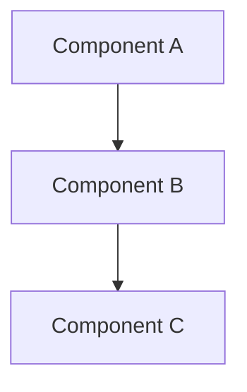

# Design: [FEATURE NAME]

**Status**: Draft | Approved
**Requirements**: [requirements.md](requirements.md)

## Overview

[High-level description of the technical approach and where this feature sits in the overall system. If meaningful alternatives were considered, name the chosen one and why in 1–2 sentences.]

## Alignment with [AGENT INSTRUCTIONS FILE]

[How this design follows the project's tech stack, structure conventions, and constraints. Call out any deliberate deviation and its justification.]

## Code Reuse Analysis

<!-- EXISTING CODEBASE: mandatory. Cite real file paths — verify they exist.
     GREENFIELD: delete this section and use "Project Structure Plan" below instead. -->

### Existing Components to Leverage

- **[path/to/component]**: [how it will be used or extended]

### Integration Points

- **[existing system/API/table]**: [how the new feature connects to it]

## Project Structure Plan

<!-- GREENFIELD only: directory tree to be created. Delete for existing codebases. -->

```text
src/
├── [dir]/   # [responsibility]
└── [dir]/   # [responsibility]
```

## Architecture

[Overall architecture and the design patterns used.]



## Components and Interfaces

<!-- One block per new or significantly modified component. -->

### [Component Name] (`path/to/file`)

- **Purpose:** [single responsibility]
- **Interface:** [public functions/methods/endpoints with signatures]
- **Dependencies:** [what it calls]
- **Reuses:** [existing code it builds on, if any]

## Data Models

```text
[Entity]
- id: [type]
- [field]: [type]  # [note if non-obvious]
```

[Include schema migrations needed for existing databases.]

## Error Handling

| Scenario | Handling | User-visible result |
|----------|----------|---------------------|
| [failure scenario] | [retry / fallback / propagate] | [message or behavior] |

## Testing Strategy

- **Unit**: [key components and logic to cover]
- **Integration**: [key flows across components to cover]
- **End-to-end**: [user scenarios to verify, mapped to acceptance criteria]
